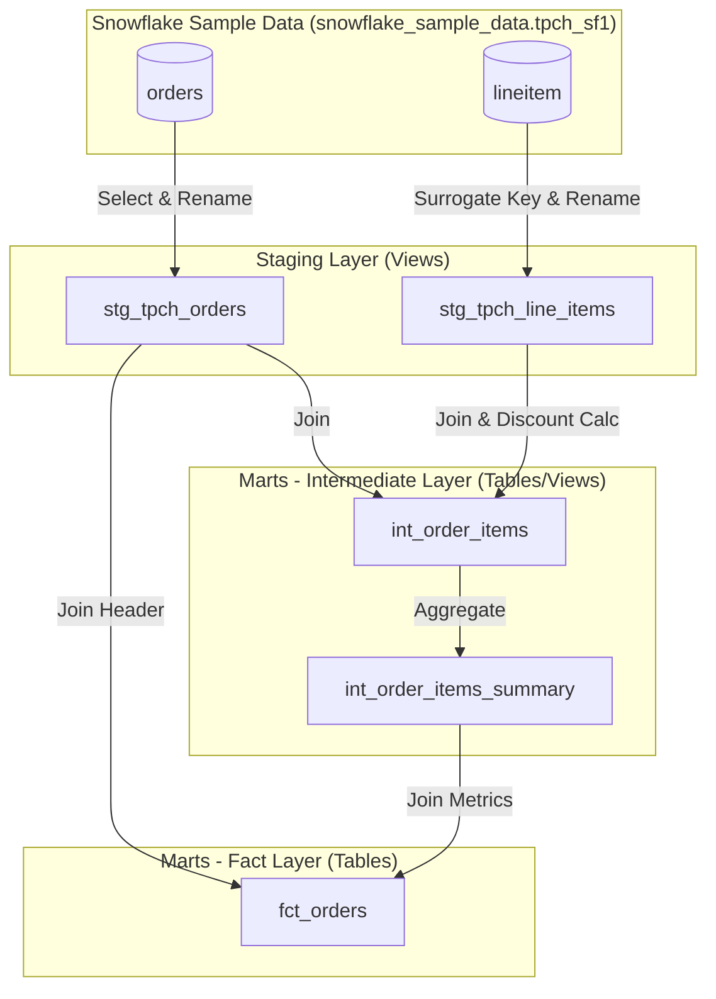
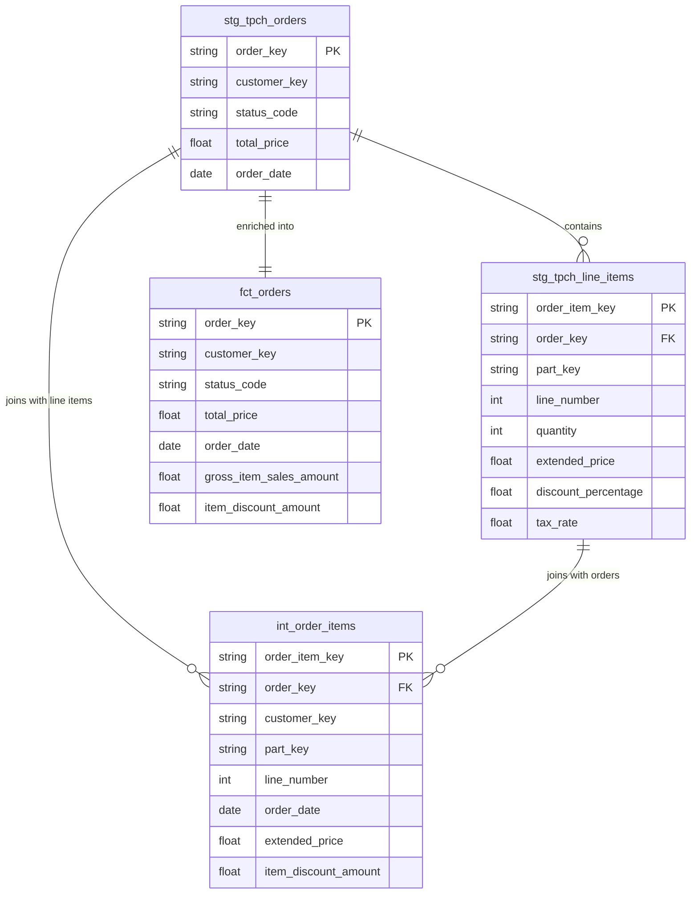

# ELT Pipeline for Snowflake Sample Data

This directory contains a **dbt (data build tool)** project configured to build an ELT (Extract, Load, Transform) pipeline using the standard TPC-H sample database in Snowflake. It structures the raw data from Snowflake's practice/example tables into optimized dimension and fact models for analytical consumption.

---

## Architecture & Data Lineage

The data pipeline processes raw data through staging, intermediate, and marts layers using a modular structure. 

### Pipeline Data Flow

The following Mermaid diagram traces the data flow from Snowflake's sample datasets to the final fact table:



---

## Data Transformations & Processing

Below is a detailed breakdown of what was done to the Snowflake practice tables and the transformed datasets.

### 1. Snowflake Practice/Example Tables (Sources)
We read from the standard **TPC-H SF1** dataset schema (`snowflake_sample_data.tpch_sf1`):
* **`orders`**: Contains information about customer purchase transactions (order date, customer ID, total price, status, etc.).
* **`lineitem`**: Contains granular details of items purchased per order (quantities, costs, discounts, tax rates, shipping details, etc.).

### 2. Staging Layer (`models/staging`)
Staging models represent raw datasets with cleaned formatting and renamed columns for standard naming conventions. They are materialized as **views**.
* **`stg_tpch_orders`**:
  * Ingests from the `tpch.orders` source.
  * Renames original source columns:
    * `o_orderkey` ➔ `order_key` *(Primary Key)*
    * `o_custkey` ➔ `customer_key`
    * `o_orderstatus` ➔ `status_code`
    * `o_totalprice` ➔ `total_price`
    * `o_orderdate` ➔ `order_date`
* **`stg_tpch_line_items`**:
  * Ingests from the `tpch.lineitem` source.
  * Generates a primary surrogate key `order_item_key` using `dbt_utils.generate_surrogate_key` on `l_orderkey` and `l_linenumber` for uniqueness.
  * Renames original source columns:
    * `l_orderkey` ➔ `order_key` *(Foreign Key to Orders)*
    * `l_partkey` ➔ `part_key`
    * `l_linenumber` ➔ `line_number`
    * `l_quantity` ➔ `quantity`
    * `l_extendedprice` ➔ `extended_price`
    * `l_discount` ➔ `discount_percentage`
    * `l_tax` ➔ `tax_rate`

### 3. Marts Layer (`models/marts`)
The marts layer performs business calculations and aggregates data into analytics-ready models. They are materialized as **tables** in the `dbt_wh` warehouse.

* **`int_order_items`** *(Intermediate)*:
  * Joins `stg_tpch_orders` and `stg_tpch_line_items` on `order_key`.
  * Computes the line-item level discount amount using a custom pricing macro (`discounted_amount`).
* **`int_order_items_summary`** *(Intermediate)*:
  * Performs aggregation on `int_order_items` grouped by `order_key`.
  * Calculates summary statistics:
    * `gross_item_sales_amount` ➔ `sum(extended_price)`
    * `item_discount_amount` ➔ `sum(item_discount_amount)`
* **`fct_orders`** *(Fact Table)*:
  * The final model that joins order header details (`stg_tpch_orders`) and aggregated order metrics (`int_order_items_summary`) on `order_key`.
  * Contains the final dataset combining order status, customer details, and total aggregated metrics (gross sales and discount amounts).

---

## Entity Relationship & Schema Mapping

The following schema diagram represents how the fields and relationships are mapped:



---

## Custom Business Logic (Macros)

To ensure consistency in pricing calculations, a custom macro has been implemented in `macros/pricing.sql`:

### `discounted_amount` Macro
This macro calculates the financial discount deduction as a negative value, keeping precision clean for currency values:

```sql

    (-1 * {{ extended_price }} * {{ discount_percentage }})::decimal(16, {{ scale }})

```
* **Parameters**:
  * `extended_price`: The pre-discount price of the item.
  * `discount_percentage`: The percentage discount applied to the item.
  * `scale` (default = `2`): Number of decimal places.
* **Usage**: Used in `int_order_items.sql` to calculate `item_discount_amount`.

---

## Data Quality & Testing

To maintain data integrity, automated testing is configured for both the staging and marts layers:

### Staging Tests (`tpch_sources.yml`)
* **`orders.o_orderkey`**:
  * `unique`: Confirms no duplicate order records exist.
  * `not_null`: Ensures all order records have an identifier.
* **`lineitem.l_orderkey`**:
  * `relationships`: Validates referential integrity (every order item must correspond to a valid `order_key` in the `orders` source table).

### Marts Tests (`generic_tests.yml`)
* **`fct_orders.order_key`**:
  * `unique` and `not_null`.
  * `relationships`: Verifies that every order in the final fact table matches a staged order (`stg_tpch_orders`). Severity is set to `warn`.
* **`fct_orders.status_code`**:
  * `accepted_values`: Restricts values to `['P', 'O', 'F']` (representing Pending, Open, and Finished statuses).

---
