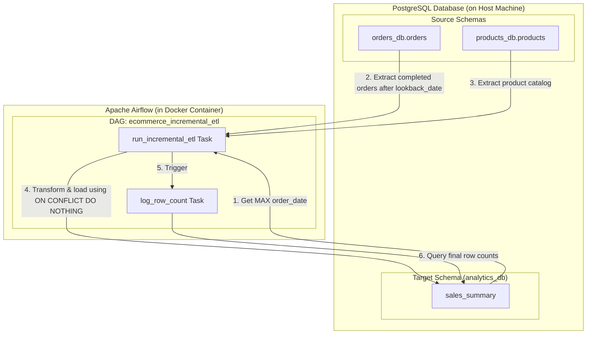
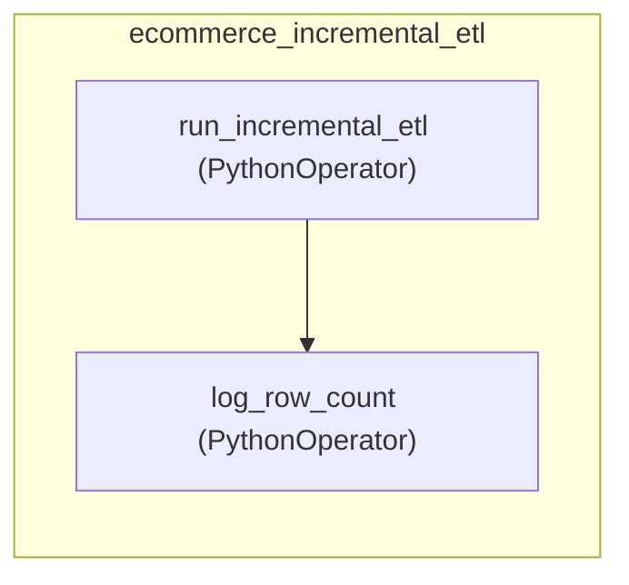

# Airflow-Orchestrated Incremental ETL Pipeline

This directory contains a containerized **Apache Airflow** environment running an **Incremental Extract, Transform, and Load (ETL)** pipeline. The workflow connects to a PostgreSQL instance on the host machine to process and aggregate e-commerce transactions periodically.

---

## Architecture & Data Flow

Below is the end-to-end data flow showing how the Python script running inside the Airflow Docker container communicates with the PostgreSQL database hosted on the developer's machine:



### Key Connectivity Concepts:
* **Host Database Integration**: The Airflow services run in a Docker network, but the business data resides in a PostgreSQL database on your local host machine. Inside Docker, `host.docker.internal` is used as the host address to securely bridge the network and query the host's localhost database.

---

## Airflow DAG Flow Diagram

The pipeline schedule and dependency tree are orchestrated by Apache Airflow. The task flow executes sequentially to ensure logging occurs only after a successful data migration:



### DAG Configurations:
* **DAG ID**: `ecommerce_incremental_etl`
* **Schedule Interval**: `*/5 * * * *` (Runs every 5 minutes)
* **Catchup**: `False` (Prevents backfilling old runs)
* **Retries**: 1 retry with a 1-minute delay on failure

---

## Incremental ETL & Watermarking Logic

Instead of querying and reloading the entire database on every run, the script [dags/etl_incremental.py](dags/etl_incremental.py) employs an **Incremental Load** strategy:

1. **Watermark Retrieval**: The script first requests the maximum `order_date` already present in the target database (`analytics_db.sales_summary`).
2. **Lookback Period (7 Days)**: To accommodate delayed status updates (e.g., pending orders completing days later), the watermark is subtracted by 7 days (`lookback_date = watermark - timedelta(days=7)`).
3. **Delta Extraction**: Only orders with `status = 'completed'` and `order_date > lookback_date` are fetched.
4. **Idempotent Load**: An `ON CONFLICT (order_id) DO NOTHING` clause prevents duplicated records when re-processing the 7-day lookback window.

---

## File Structure

- [docker-compose.yaml](docker-compose.yaml) — Custom Airflow CeleryExecutor cluster config with Redis and Postgres metadata stores.
- [setup.sql](setup.sql) — Initializes the schemas (`orders_db`, `products_db`, and `analytics_db`), tables, mock data, and staging indexes.
- [dags/etl_dag.py](dags/etl_dag.py) — Defines the Airflow DAG schedule, tasks, and sequence of operation.
- [dags/etl_incremental.py](dags/etl_incremental.py) — Contains the core Python methods for querying, transforming, and loading.
- [.env](.env) — Declares system level environment variables (e.g., `AIRFLOW_UID`).
- [requirements.txt](requirements.txt) — Declares standard Python packages needed in this environment.

---

## Step-by-Step Setup

### Step 1: Initialize Database Tables
Run the SQL queries in [setup.sql](setup.sql) on your PostgreSQL database (running on your host computer) to build the e-commerce mock database:
```powershell
# Example using psql
psql -h localhost -U postgres -d postgres -f setup.sql
```

### Step 2: Configure Environment
Open [.env](.env) and verify the `AIRFLOW_UID` is configured. If running on Linux/macOS, dynamically set your local UID to prevent volume permission bugs:
```bash
echo "AIRFLOW_UID=$(id -u)" > .env
```

### Step 3: Launch Apache Airflow
Run Docker Compose to pull the official `apache/airflow` images, initialize the metadata database, and boot up the cluster services:
```powershell
# Initialize Airflow database
docker compose up airflow-init

# Start all scheduler, worker, and webserver services in the background
docker compose up -d
```

### Step 4: Activate the DAG
1. Navigate to the Airflow UI at http://localhost:8080 (default credentials: `airflow`/`airflow`).
2. Search for the DAG **`ecommerce_incremental_etl`**.
3. Toggle the switch to **Active/Unpause**.
4. Monitor active runs, task runtimes, logs, and outputs directly inside the grid view.

---

## Monitoring and Logs

* **Console Outputs**: Tasks log detailed summaries showing rows processed, rows skipped, and updated watermarks.
* **Volume Mounts**: Container files are synchronized locally:
  * Airflow scheduler logs are saved under `logs/`.
  * Customized configurations can be tweaked inside `config/airflow.cfg`.
