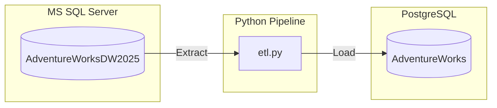

# Extract & Load ETL Pipeline

This directory contains a simple **Extract and Load (EL)** pipeline that migrates data from **Microsoft SQL Server** to **PostgreSQL**. It is designed to demonstrate basic extraction of dimension and fact tables, and loading them into staging tables in a destination database.

## Architecture & Workflow



1. **Extract**: Connects to the source SQL Server database (`AdventureWorksDW2025`) using `pyodbc` and `SQLAlchemy`. Reads specific tables into memory using `pandas`:
   - `DimProduct`
   - `DimProductSubcategory`
   - `DimProductCategory`
   - `DimSalesTerritory`
   - `FactInternetSales`
2. **Load**: Connects to the target PostgreSQL database (`AdventureWorks`) and loads the tables with a `stg_` prefix (e.g., `stg_DimProduct`) using `pandas.DataFrame.to_sql()`.

---

## File Structure

- [etl.py](extract_load/etl.py) — The main python script orchestrating the extract and load process.
- [drivercheck.py](extract_load/drivercheck.py) — A utility script to verify PostgreSQL database connectivity.
- [etl_user_postgres_script.sql](extract_load/etl_user_postgres_script.sql) — SQL script to set up PostgreSQL database, create the `etl` user, and grant privileges.
- [sql_server_etl_user.sql](extract_load/sql_server_etl_user.sql) — SQL script to set up SQL Server login, user, and reader roles.
- [requirements.txt](extract_load/requirements.txt) — Python dependencies (`SQLAlchemy`, `pandas`, `pyodbc`).

---

## Setup & Configuration

### 1. Database Configuration

Before running the python scripts, you need to prepare the databases:

#### PostgreSQL (Target Database)
Run the script [etl_user_postgres_script.sql](extract_load/etl_user_postgres_script.sql) on your PostgreSQL server.
This script will:
- Create the target database `AdventureWorks`.
- Create a user `etl` with password `demopass`.
- Grant the required connection and table permissions to `etl`.

#### SQL Server (Source Database)
Ensure you have the `AdventureWorksDW2025` database attached to SQL Server.
Run the script [sql_server_etl_user.sql](extract_load/sql_server_etl_user.sql) on your SQL Server database.
This script will:
- Create login and user `etl` with password `demopass`.
- Assign `db_datareader` role to `etl` for reading `AdventureWorksDW2025` tables.

### 2. Environment Variables
The Python scripts read database credentials from your system environment variables. You must set these variables before running the pipeline:

- `PGUSER`: Username for the SQL Server & PostgreSQL target (e.g., `etl` or `postgres`).
- `PGPASSWORD`: Password for the SQL Server & PostgreSQL target.

*Note: The script uses these variables for both databases (`etl` user setup script handles user creation).*

### 3. Installation
Activate your virtual environment and install the required dependencies:

```powershell
pip install -r requirements.txt
```

> [!NOTE]
> Running MS SQL Server integration requires the **ODBC Driver for SQL Server** installed on your operating system. The script defaults to `ODBC Driver 18 for SQL Server`.

---

## How to Run

### Step 1: Verify PostgreSQL Connectivity
You can test the PostgreSQL connection details using `drivercheck.py`:
```powershell
python drivercheck.py
```
If successful, it will output:
```text
Connected to PostgreSQL!
```

### Step 2: Run the ETL Pipeline
Run the main ETL script to perform extraction and loading:
```powershell
python etl.py
```
This will:
1. Extract data from each target SQL Server table.
2. Output loading progress logs to the console.
3. Overwrite/replace staging tables `stg_<table_name>` inside the target `AdventureWorks` database.
