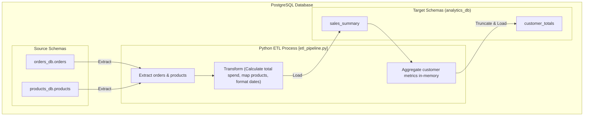

# Extract, Transform & Load (ETL) Pipeline

This directory contains a complete **Extract, Transform, and Load (ETL)** pipeline that processes orders and products data to generate analytics summaries and customer totals inside a **PostgreSQL** database.

## Architecture & Workflow



1. **Extract**: Queries the `orders_db.orders` table for `completed` orders and extracts all products from `products_db.products`.
2. **Transform**:
   - Matches each order to its corresponding product.
   - Skips orders without matching products and logs skipped counts.
   - Calculates `total_amount` (`quantity * unit_price`).
   - Extracts and formats the order date into `order_month` (`YYYY-MM`).
3. **Load**:
   - Inserts processed records into `analytics_db.sales_summary` (uses `ON CONFLICT (order_id) DO NOTHING` to prevent duplicates).
4. **Aggregate & Re-load**:
   - Re-extracts sales records, calculates cumulative `total_spend` and `order_count` for each customer using Python dictionaries.
   - Truncates `analytics_db.customer_totals` and inserts the updated aggregated results.

---

## File Structure

- [etl_pipeline.py](extract_transform_load/etl_pipeline.py) — The Python script managing the entire ETL workflow and database connections.
- [setup.sql](extract_transform_load/setup.sql) — Setup script to create schemas, source tables with sample data, target analytics tables, and constraints.
- [requirements.txt](extract_transform_load/requirements.txt) — Python dependencies list (Note: the script directly uses `psycopg2`).

---

## Database Schema & Setup

Run the SQL statements in [setup.sql](file:///c:/Users/DELL/Desktop/data-eng/extract_transform_load/setup.sql) on your PostgreSQL instance (e.g., using `psql` or `pgAdmin` under your target database).

This script will set up:
- **`orders_db.orders`**: Source table representing user orders (`completed`, `pending`, `cancelled`). Prepopulated with sample data.
- **`products_db.products`**: Source catalog representing products and prices. Prepopulated with sample data.
- **`analytics_db.sales_summary`**: Destination table for transformed sales data. Features a unique constraint on `order_id` to prevent duplicate ETL runs.
- **`analytics_db.customer_totals`**: Destination table tracking aggregated customer spend metrics.

---

## Prerequisites & Installation

### 1. Database Connection Configuration
Open [etl_pipeline.py](extract_transform_load/etl_pipeline.py) and configure the database connection details in lines 4-8:

```python
conn = psycopg2.connect(
    host='localhost', port=5432,
    dbname='postgres',
    user='postgres', password='1234'
)
```

### 2. Dependencies
Ensure you have `psycopg2` or `psycopg2-binary` installed in your environment:

```powershell
pip install psycopg2-binary
```

---

## How to Run

Execute the ETL script from your terminal:

```powershell
python etl_pipeline.py
```

### Example Console Output
Upon successful completion, the script logs execution metrics:

```text
Orders extracted: 3
Products extracted: 3

--------- ETL SUMMARY ----------
Orders extracted : 3
Products extracted : 3
Rows skipped : 0
Customer totals generated for 2 customers
Loaded : 3 rows in analytics_db.sales_summary
------------------------------------
```
